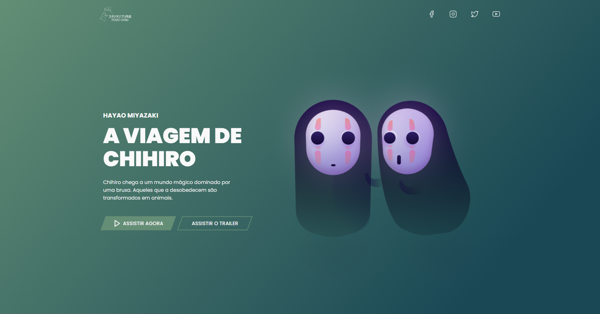

  <a href="#-tecnologias">Tecnologias</a>&nbsp;&nbsp;&nbsp;|&nbsp;&nbsp;&nbsp;
  <a href="#-projeto">Projeto</a>&nbsp;&nbsp;&nbsp;

## 🚀 Tecnologias

Este projeto foi desenvolvido com as seguintes tecnologias:

- HTML
- CSS

## 💻 Projeto

O layout do projeto foi baseado no desafio 5 do @iuricode para treinamento de habilidades com HTML5 e CSS3.

Você pode visualizar o layout do projeto original através [desse link](https://www.figma.com/file/Yb9IBH56g7T1hdIyZ3BMNO/Desafios---Codel%C3%A2ndia?node-id=5854%3A2) (o meu está modificado). É necessário ter conta no [Figma](https://figma.com) para acessá-lo.

<h5 align="center"><a href="https://studio-ghibli-desafio5.vercel.app/">ACESSE AQUI O PROJETO</a></h5>

---

Feito com ❤️ por Rakel Moreira.
